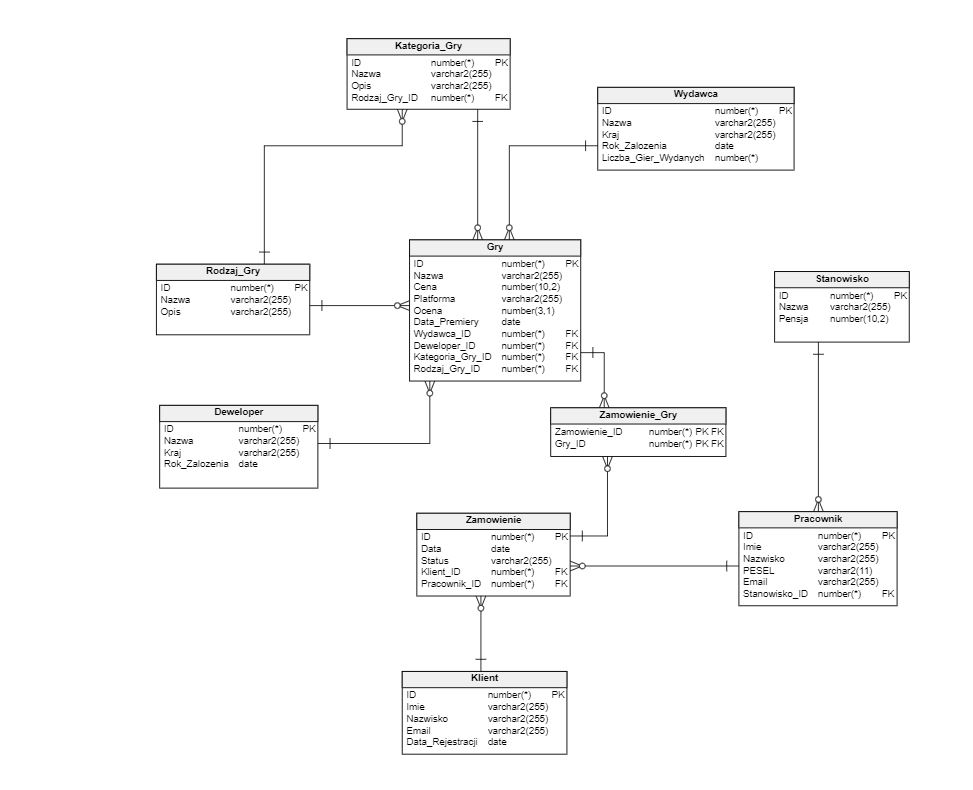

# PL/SQL Project: Video Game Store Database

This PL/SQL project involves the creation of a database schema for a video game store. It includes the definition of tables for various entities such as game categories, game genres, developers, games, orders, customers, employees, job positions, and more. The project also features data insertion scripts and triggers to enforce certain business rules and behaviors within the database.

## Project Components

- `Generacja_tablic.sql`: This file contains the SQL statements to create the necessary database tables for entities like game categories, game genres, developers, games, orders, customers, employees, and job positions.

- `Wrzucanie_danych.sql`: In this file, data insertion scripts are provided to populate the tables with sample data.

- `Faza_2_SELECT.sql`: This file contains various SQL queries that retrieve information from the database using JOINs, aggregate functions, subqueries, and correlated subqueries. These queries retrieve game and order-related information.

- `Faza_3_triggery.sql`: The file includes SQL trigger definitions to enforce certain business logic. It defines triggers for scenarios like setting default values, preventing negative values, and reacting to changes in the database.

## Usage

1. Create the database schema by executing the statements in `Generacja_tablic.sql`.

2. Populate the tables with sample data using the scripts in `Wrzucanie_danych.sql`.

3. Explore the database by running the queries in `Faza_2_SELECT.sql`.

4. Observe the triggers' behavior by executing the statements in `Faza_3_triggery.sql`.

## Contributing

If you'd like to contribute to this project, feel free to fork the repository and submit a pull request with your changes.

## License

This project is licensed under the [MIT License](LICENSE).
